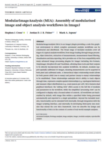

[](https://doi.org/10.5281/zenodo.1201320)
[](https://javadoc.io/doc/io.github.mianalysis)
[](https://central.sonatype.com/namespace/io.github.mianalysis)
[](https://github.com/mianalysis/mia/actions/workflows/tests.yml)


[](https://www.bristol.ac.uk/wolfson-bioimaging/)

About MIA
------------
ModularImageAnalysis (MIA) is an ImageJ plugin which provides a modular framework for assembling image and object analysis workflows. Detected objects can be transformed, filtered, measured and related. Analysis workflows are batch-enabled by default, allowing easy processing of high-content datasets.

For the full documentation, please go to [mianalysis.github.io](https://mianalysis.github.io)


Paper and poster
------------

You can check out the MIA paper [here](https://onlinelibrary.wiley.com/doi/10.1111/jmi.13227) and the latest MIA poster from CBIAS 2022 [here](./resources/img/CBIAS_poster_2022.jpg)
<p align="middle">
<a href="https://onlinelibrary.wiley.com/doi/10.1111/jmi.13227"></a> <a href="https://github.com/mianalysis/mia/tree/main/resources/img/CBIAS_poster_2022.jpg"></a>
</p>

Installation
------------
### Via the update site
The latest version of MIA can be installed directly into Fiji via an update site.
1. Launch the ImageJ [Updater](https://imagej.net/Updater) from Help > Update...
2. Click "Manage update sites" and in the window that opens, click "Add update site" 
3. Ensure the following two update sites are ticked:
   - IJPB-plugins
   - ModularImageAnalysis
4. Close the "Manage update sites" window, then click "Apply changes" in the Updater window

### Manually from GitHub
Specific versions of MIA can be downloaded from GitHub and installed into Fiji manually.

Note: If installing MIA manually, the ModularImageAnalysis update site should be disabled from the ImageJ Updater.
1. Download the desired version of MIA from the [Releases](https://github.com/mianalysis/mia/releases) page.
2. Place this .jar file into the /plugins directory of the your Fiji installation.
3. Install [MorphoLibJ](https://imagej.net/plugins/morpholibj) using the instructions [here](https://imagej.net/plugins/morpholibj#installation)

Using MIA
------------
Guides for using MIA can be found [here](https://mianalysis.github.io/guides).  There are also example workflows in the [mia-examples](https://github.com/mianalysis/mia-examples) repository (with more to be added over time).

Questions and feedback
------------
If you'd like to ask any questions about MIA, please do so via the [image.sc](https://forum.image.sc) forum using the tag [modular-image-analysis](https://forum.image.sc/tag/modular-image-analysis).

For reporting bugs, please use our [GitHub Issues](https://github.com/mianalysis/mia/issues) page.

Contributing
------------
We welcome any contributions to the MIA project.  If you'd like to get involved, there are a few ideas on how you could do so in our [get involved](https://mianalysis.github.io/getinvolved) guide, but any involvement, big or small, would be greatly appreciated.

If you'd like to include the latest version of MIA in your project, you can add the following dependency to your pom.xml file:

```
<dependency>
    <groupId>io.github.mianalysis</groupId>
    <artifactId>mia-plugin</artifactId>
    <version>1.5.0</version>
</dependency>
```

Alternatively, if you only want to use a part of MIA (e.g. the quadtree coordinate system), you can find a list of MIA's Maven modules [here](https://central.sonatype.com/namespace/io.github.mianalysis).

The JavaDocs for MIA are available [here](https://javadoc.io/doc/io.github.mianalysis).

Acknowledgements
------------
The plugin makes use of a combination of plugins packaged with Fiji as well as others that can be installed via the updater.

Required plugins pre-packaged with Fiji: [AnalyzeSkeleton](https://github.com/fiji/AnalyzeSkeleton), [Auto Threshold](https://github.com/fiji/Auto_Threshold), [bUnwarpJ](https://github.com/fiji/bUnwarpJ), [Bio-Formats](https://github.com/openmicroscopy/bioformats), [Colour Deconvolution](https://github.com/fiji/Colour_Deconvolution), [Correct Bleach](https://github.com/fiji/CorrectBleach), [MPICBG](https://github.com/axtimwalde/mpicbg), [TrackMate](https://github.com/fiji/TrackMate), [Weka Trainable Segmentation](https://github.com/fiji/Trainable_Segmentation).  Required plugins that need installing via the ImageJ updater: [MorphoLibJ](https://github.com/ijpb/MorphoLibJ).  Plugins bundled with MIA: [Stack Focuser](https://imagej.nih.gov/ij/plugins/stack-focuser.html).

A list of bundled dependencies along with their respective licenses can be found [here](https://htmlpreview.github.io/?https://github.com/mianalysis/mia/blob/master/target/site/dependencies.html).

Special thanks to all MIA users who have provided vital feedback over the years.  In particular, big thanks to Dr. Dominic Alibhai for his many suggestions and ideas.

Citing MIA
------------
We hope you find MIA useful.  If you've used MIA in your research, please cite the following paper:

Cross, S.J., Fisher, J.D.J.R. & Jepson, M.A., "ModularImageAnalysis (MIA): Assembly of modularised image and object analysis workflows in ImageJ", _Journal of Microscopy_ (2023), doi: [110.1111/jmi.13227](https://onlinelibrary.wiley.com/doi/10.1111/jmi.13227).

MIA is also archived at Zenodo, which provides a unique DOI for each released version. Zenodo DOIs can be found [here](https://doi.org/10.5281/zenodo.1201320).

Publications
------------
MIA has been used in a variety of different analyses, a few published examples of which are listed below. For a more complete list, please go to [Publications](https://mianalysis.github.io/publications.html).

Edmunds, G.L., _et al._, "Adenosine 2A receptor and TIM3 suppress cytolytic killing of tumor cells via cytoskeletal polarization", _Communications Biology_ (2022) **5**, doi: [10.1038/s42003-021-02972-8](https://doi.org/10.1038/s42003-021-02972-8)

Kague, E., _et al._, "3D assessment of intervertebral disc degeneration in zebrafish identifies changes in bone density that prime disc disease", _Bone Research_ (2021) **9**, doi: [10.1038/s41413-021-00156-y](https://doi.org/10.1038/s41413-021-00156-y)

McCaughey, J., _et al._, "ER-to-Golgi trafficking of procollagen in the absence of large carriers", _J Cell Biol_ (2019) **218** 929-948, doi: [10.1083/jcb.201806035](https://doi.org/10.1083/jcb.201806035)

Roloff, E.v.L., _et al._, "Differences in autonomic innervation to the vertebrobasilar arteries in spontaneously hypertensive and Wistar rats", _J Physiol_ (2018) **596** 3505-3529, doi: [10.1113/JP275973](https://doi.org/10.1113/JP275973)

Ongoing development
------------
This plugin is still in development and test coverage is currently incomplete.  Please keep an eye on results and add an [issue](https://github.com/mianalysis/mia/issues) if any problems are encountered.

